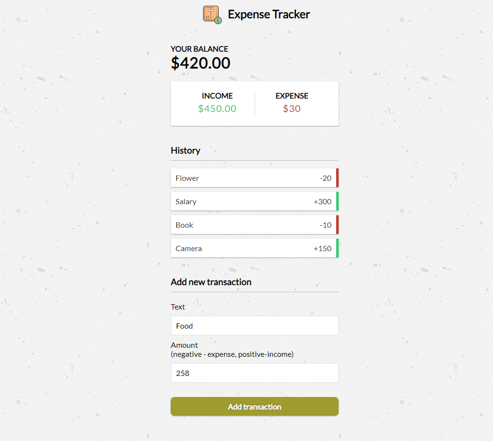

## Expense Tracker

> Keep track of income and expenses. Add and remove items and save to local storage

### [Demo](http://expense-tracker-js-ab.surge.sh)
[](https://radikal.ru/video/unyldKI4ag1)

### Get started

```shell script
git clone
```
```shell script
open index.html
```
or
```shell script
npm i -g live-server
```
```shell script
live-server
```
